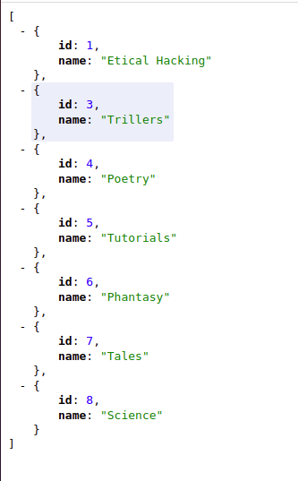
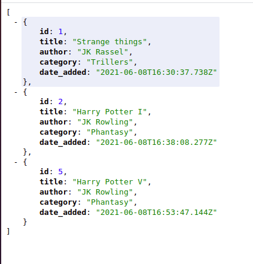

# README

- [Source Part 1](https://www.microverse.org/blog/test-driven-development-of-restful-json-api-with-rails)
 - [Source Part 2](https://www.microverse.org/blog/build-a-restful-api-authentication-with-jwt)

 ### Respect @acushlakoncept for this great tutorial

 #### It works correctly for all the requests now

 - The documentation is available here:  
[Publish Documentation / POSTMAN](https://documenter.getpostman.com/view/13821409/TzY7dDke)
- Categories info JSON
- 

- Books info JSON
- 

### Prerequisites

- Ruby v2.7.2
- Ruby on Rails v6.1.3.1
- Postgres: >=9.5
- Rspec
- Heroku

### Getting Started

To get a local copy up and running follow these simple example steps.
- `git clone https://github.com/Laguna1/fav-books/tree/development`
- `cd api-back`

### Setup

Instal gems with:

- `bundle install`

Setup database with:
 - `rails db:create`
 - `rails db:migrate`

### Usage

Start server with:

- `rails s`

Open `http://localhost:3000/` in your browser.

### Run tests

- `rspec`

### Author

👤 **Oksana Petrova**

- GitHub: [@github/Laguna1](https://github.com/Laguna1)
- Linkedin: [linkedin/OksanaPetrova](https://www.linkedin.com/in/oksana-petrova/)
- Twitter: [@OksanaP48303303](https://twitter.com/OksanaP48303303)

### 🤝 Contributing

Contributions, issues and feature requests are welcome!

Feel free to check the [issues page](https://github.com/Laguna1/fav-books/issues)

### Show your support

Give a ⭐️ if you like this project!

### Acknowledgments

You can access all the design info - color, typography, layouts - at this link:

### 📝 License
This project is [MIT](https://github.com/Laguna1/fav-books/LICENSE) licensed.
